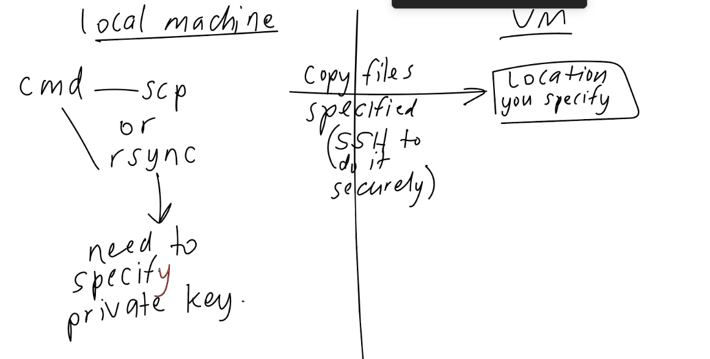

# Azure - now with more azure 

## Create a new VM with Ubunutu 22.04 LTS: 

to do: should have a bash script when opening a new VM to update and upgrade  

### basic 

### disk 

## copy sparta test app to VM 

### Using scp 
`scp -r nodejs20-sparta-test-app azureuser@20.77.113.224:home/azureuser` 
 
-r flag needs to be used to copy directory contents.  
azure@user specifies user you want to log in as to the VM  
 
**or using ssh**:  
`scp -i ~/.ssh/tech501-emily-az-key -r nodejs20-sparta-test-app azureuser@20.77.113.224:home/azureuser`
 
-i (identity flag), in this case used to add a ssh 

## add port rule + create new network security group 

### using github 

## Deploy the Sparta test app

* cd into app 
* npm install 
* check permissions over app folder (should have full) 
* node app.js or npm start 
* ctrl c to exit 
* webadress:3000 to view 

## making a generalised image 

* Move your app code from adminuser home directory to root directory (so in the root directory you will have a "repo" folder, containing an "app" folder)
* waagent command that will wipe out the adminuser folder `waagent -deprovision+user` in command line 
* stop and wait for VM to deprovision 
* make an image in azure: capture > image (in menu)

* setting up the image: 
  *  No need to have the image in the gallery 
  *  name image: tech501-emily-sparta-app-ready-to-run

# 28/01/25 

## making a database VM 

### dependancys:

