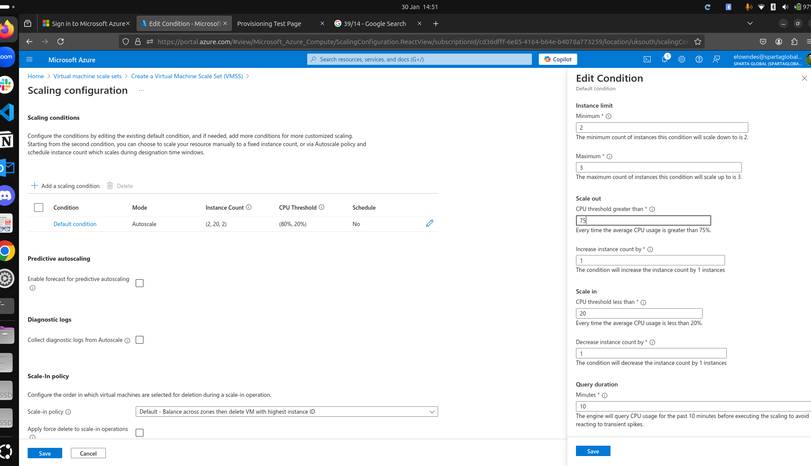

# Monitoring, Alerts and Scaling 

- [Monitoring, Alerts and Scaling](#monitoring-alerts-and-scaling)
    - [dashboard creation code along](#dashboard-creation-code-along)
      - [install apache bench:](#install-apache-bench)
  - [autoscaling](#autoscaling)
    - [why?](#why)
    - [types of scaling](#types-of-scaling)
    - [complext arcitecture involves planning](#complext-arcitecture-involves-planning)
    - [How does automated scaling work?](#how-does-automated-scaling-work)
    - [code-along - creating a virtual machine scale set](#code-along---creating-a-virtual-machine-scale-set)
      - [set up](#set-up)
      - [running the scale set](#running-the-scale-set)


### dashboard creation code along

* go to monitoring tab within overview 
* can look at metrics, which are running automatically 
* can create a custom dashboard: 


#### install apache bench: 
sudo apt-get install apache2-utils
test cpu 

## autoscaling

### why? 


### types of scaling 

| vertical | horisontal|
|---|---|
|scale up|scale out|

*research and add comparison table here*

### complext arcitecture involves planning 

* Azure VM scale set with high avalability (HA) and scalability 
* automatic scalability helps with high avalability, but they are not the same thing 

### How does automated scaling work? 


### code-along - creating a virtual machine scale set 
#### set up 
* there are some different options to creating a regular virtual machine that need to be selected (if not specified use standard settings from week 1 notes)
* basics tab: 
  * tick avalability zones 1, 2 and 3 
  * orchestration mode: uniform 
  * scaling: autoscaling 
    * scaling configuration > edit condition 
      * 
      * in summary: autoscale, 2,2,3
  * licencing: other
* network interface: 
  * use my virtual network (...subnet-2-...)
  * select public subnet 
  * advanced 
  * network security group: allow-http-ssh-3000
  * create a load balancer if needed or select own from dropdown
  * 
* health tab: 
  * tick automatic repairs, leave rest of settings
* advanced tab: 
  * tick enable user data
  * insert bash script: 
  * 
    ```
    #!/bin/bash
    # navigating into app folder
    cd /repo/app
    #starting the app
    pm2 start app.js
    ```
#### running the scale set 

* if its running correctly the instances should both be running and passing
* when the vmss is relaunched you will need to re-image the instances in order to get them running 


