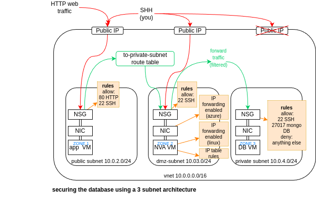

# Monitoring, Alerts and Scaling 

- [Monitoring, Alerts and Scaling](#monitoring-alerts-and-scaling)
  - [autoscaling](#autoscaling)
    - [why?](#why)
    - [types of scaling](#types-of-scaling)
    - [complex arcitecture involves planning](#complex-arcitecture-involves-planning)
    - [How does automated scaling work?](#how-does-automated-scaling-work)
    - [code-along - creating a virtual machine scale set](#code-along---creating-a-virtual-machine-scale-set)
      - [set up](#set-up)
      - [running the scale set](#running-the-scale-set)
  - [Security](#security)
    - [securing the database using a 3 - subnet architecture](#securing-the-database-using-a-3---subnet-architecture)
    - [code-along set up new virtual network](#code-along-set-up-new-virtual-network)
      - [steps:](#steps)
      - [Create v-net and subnets](#create-v-net-and-subnets)
      - [Create DB VM from image](#create-db-vm-from-image)
      - [Create app VM from image](#create-app-vm-from-image)
      - [Check connection via Ping](#check-connection-via-ping)
      - [Create NVA VM](#create-nva-vm)
  - [](#)
      - [Create route table \& associate with subnet](#create-route-table--associate-with-subnet)
      - [Enable IP forwarding for NVA VM](#enable-ip-forwarding-for-nva-vm)
      - [Setup IP table rules](#setup-ip-table-rules)
      - [Setup stricter rules on the DB VM](#setup-stricter-rules-on-the-db-vm)


## autoscaling

### why? 


### types of scaling 

| vertical | horisontal|
|---|---|
|scale up|scale out|

*research and add comparison table here*

### complex arcitecture involves planning 

* Azure VM scale set with high avalability (HA) and scalability 
* automatic scalability helps with high avalability, but they are not the same thing 

### How does automated scaling work? 


### code-along - creating a virtual machine scale set 
#### set up 
* there are some different options to creating a regular virtual machine that need to be selected (if not specified use standard settings from week 1 notes)
* basics tab: 
  * tick avalability zones 1, 2 and 3 
  * orchestration mode: uniform 
  * scaling: autoscaling 
    * scaling configuration > edit condition 
      * 
      * in summary: autoscale, 2,2,3
  * licencing: other
* network interface: 
  * use my virtual network (...subnet-2-...)
  * select public subnet 
  * advanced 
  * network security group: allow-http-ssh-3000
  * create a load balancer if needed or select own from dropdown - configure ports 50000 and 50001
  * 
* health tab: 
  * tick automatic repairs, leave rest of settings
* advanced tab: 
  * tick enable user data
  * insert bash script: 
  * 
    ```
    #!/bin/bash
    # navigating into app folder
    cd /repo/app
    #starting the app
    pm2 start app.js
    ```
#### running the scale set 

* if its running correctly the instances should both be running and passing
* when the vmss is relaunched you will need to re-image the instances in order to get them running 


## Security 

### securing the database using a 3 - subnet architecture 

* nic network interface card - connected to network security group which has rules about what can be allowed in 
* NIC enables interaction 
* NSG chooses what is allowed 
<br>

* diagram red arrows = potentially dangerous traffic
* database only has a public ip to allow us to ssh into it, otherwise not needed *HOW??*
* bastion host is an option, but very expensive*


### code-along set up new virtual network 

#### steps:
```
    Create v-net and subnets
    Create DB VM from image
    Create app VM from image
    Check connection via Ping
    Create NVA VM
    Create route table
    Setup route in route table
    Enable IP forwarding for NVA VM on Azure
    Enable IP forwarding for NVA VM on Linux
    Setup NVA VM
    Setup IP table rules
    Setup stricter rules on the DB VM
``` 

#### Create v-net and subnets
*add later from screenshots*

#### Create DB VM from image

*add later from screenshots*
#### Create app VM from image

**Advanced tab:** 
* export command needs to match db private ip adress 
```
#!/bin/bash
# navigating into app folder
 cd /repo/app
 #connect to db
export DB_HOST=mongodb://10.0.4.4:27017/posts
 #starting the app
 pm2 start app.js 
```
#### Check connection via Ping 
* ssh into the app VM 
* run `ping 10.0.4.4` to contact db VM 
* this should be left running to check connection during set-up 


#### Create NVA VM

**basics tab**
* avalability zone: zone 2 
* security type: standard
* image: Ubuntu Server 22.04 LTS - x64 Gen2
* Username: adminuser 
<br>
--- 

**networking tab** 
* use 3-subnet-vnet
* dmz subnet
* include public IP 

#### Create route table & associate with subnet 

*in azure:* <br>
* navigate to resource > routes > setings 
* **Route name**: to-private-subnet-route
* **Destination type**: IP Addresses 
* **Destination IP addresses/CIDR ranges**: 10.0.4.0/24 (db private subnet)
<br>

**Ping should now have stopped????** 

#### Enable IP forwarding for NVA VM
*in azure:* <br>
* navigate to route table > settings > subnets 
* click associate + choose public subnet (your app VM) 
<br>
*in NVA VM*: <br>
* run `sysctl net.ipv4.ip_forward`
* navigate to the config file with `sudo nano /etc/sysctl.conf`
* within the file uncomment this line which sets forward to 1, as below, then save + exit 
  
```
# Uncomment the next line to enable packet forwarding for IPv4 net.ipv4.ip_forward=1
```

* following this the config file needs to be reloaded with `sudo sysctl -p`
* check IP forwarding by running `sysctl net.ipv4.ip_forward` which should be `= 1`
<br>
**following this pings should resume??? ** 

#### Setup IP table rules

* need to ssh into our NVA VM 
* check iptables are installed using `sudo iptables --help` 
* create a bash script that sets up the ip table rules `sudo nano config-ip-tables.sh` 
* paste in the following script, save and exit: 

```
#!/bin/bash
 
# configure iptables
 
echo "Configuring iptables..."
 
# accept local input and output from the same server 
sudo iptables -A INPUT -i lo -j ACCEPT
sudo iptables -A OUTPUT -o lo -j ACCEPT
 
# allow establised connections in
sudo iptables -A INPUT -m state --state ESTABLISHED,RELATED -j ACCEPT
 
# allow establised connections out
sudo iptables -A OUTPUT -m state --state ESTABLISHED -j ACCEPT
 
# drops invalid packets
sudo iptables -A INPUT -m state --state INVALID -j DROP
 
# allows communication about ongoing or ongoing related requests
sudo iptables -A INPUT -p tcp --dport 22 -m state --state NEW,ESTABLISHED -j ACCEPT
sudo iptables -A OUTPUT -p tcp --sport 22 -m state --state ESTABLISHED -j ACCEPT
 
# uncomment the following lines if want allow SSH into NVA only through the public subnet (app VM as a jumpbox)
# this must be done once the NVA's public IP address is removed
#sudo iptables -A INPUT -p tcp -s 10.0.2.0/24 --dport 22 -m state --state NEW,ESTABLISHED -j ACCEPT
#sudo iptables -A OUTPUT -p tcp --sport 22 -m state --state ESTABLISHED -j ACCEPT
 
# uncomment the following lines if want allow SSH to other servers using the NVA as a jumpbox
# if need to make outgoing SSH connections with other servers from NVA
#sudo iptables -A OUTPUT -p tcp --dport 22 -m conntrack --ctstate NEW,ESTABLISHED -j ACCEPT
#sudo iptables -A INPUT -p tcp --sport 22 -m conntrack --ctstate ESTABLISHED -j ACCEPT
 
# forwards mongodb requests originating from public subnet to the private subnet 
sudo iptables -A FORWARD -p tcp -s 10.0.2.0/24 -d 10.0.4.0/24 --destination-port 27017 -m tcp -j ACCEPT
 
# rule allows ICMP traffic for diagnostics
sudo iptables -A FORWARD -p icmp -s 10.0.2.0/24 -d 10.0.4.0/24 -m state --state NEW,ESTABLISHED -j ACCEPT
 
# ADD COMMENT ABOUT WHAT THE FOLLOWING COMMAND(S) DO
sudo iptables -P INPUT DROP
 
# ADD COMMENT ABOUT WHAT THE FOLLOWING COMMAND(S) DO
sudo iptables -P FORWARD DROP
 
echo "Done!"
echo ""
 
# make iptables rules persistent
# it will ask for user input by default
 
echo "Make iptables rules persistent..."
sudo DEBIAN_FRONTEND=noninteractive apt install iptables-persistent -y
echo "Done!"
echo ""
``` 
* add execute permissions to the file you've just created `sudo chmod +x config-ip-tables.sh` and check permissions using `ls -l` 
* should see: `-rwxr-xr-x`
* then run the script `./config-ip-tables.sh`

#### Setup stricter rules on the DB VM
*in azure network security group:* <br>
* create a rule to allow mongo db access: 

* Create second rule:
  * Rule 2: Deny access to everything else :
  * Source: Any
  * Destination: Any
  * Service: custom
  * Destination port ranges: * (meaning all)
  * Choose Deny as action
  * Priority: 1000
