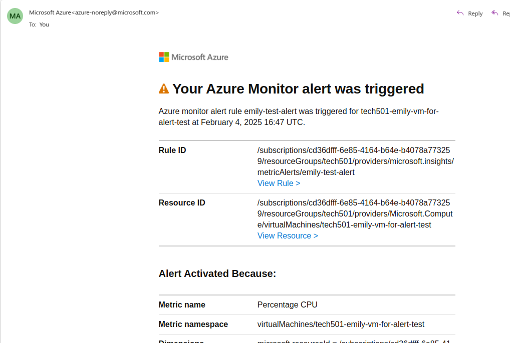

# Monitoring 

## 


## dashboard creation code along

* go to monitoring tab within overview 
* can look at metrics, which are running automatically 
* can create a custom dashboard: 

*image missing? - add again*

## install apache bench: 

```
Installing the Apache Bench benchmarking tool on the app VM:
sudo apt-get install apache2-utils

Confirming the installation:

ab

Running a load-test with 1000 requests at a concurrency of 100 requests on my app's IP:

ab -n [flag for specifying number of requests] [no. of requests] -c [flag for specifying how many requests to perform at a time, i.e. concurrently] [no. of concurrent requests] [URL of website to perform benchmarking on]

ab -n 1000 -c 100 <publicIP>
```


## tuesday pm solo task 
### instructions: 
```
    Document what was done in the code-along, including... 
        What is worst to best in terms of monitoring and responding to load/traffic. 
        How you setup a dashboard 
        How a combination of load testing and the dashboard helped us 
        Include a screenshot of your dashboard when you manage to get it to stop responding through extreme load testing 
    Create a CPU usage alert for your app instance → you should get a notification sent your email 
        Get the alert to check the average for each minute 
    Document... 
        How to setup CPU usage alert 
        Include a screenshot of the email you received as a notification 
    Post a link to your documentation in the chat around COB 
    In Azure, remove your dashboards and alert and action group 
    Document... 
        How to clean up for this task 

Link to help with Step 2 above: https://www.stephenhackers.co.uk/azure-monitoring-alert-on-virtual-machine-cpu-usage/ 

Hints: 

    You need to set the threshold low enough that the CPU utilization will trigger an alert when you do heavy load testing and you get an email notification 
    During cleanup: After deleting your alert, you will still need to delete your action group 
``` 
--- 
### 
1. start a new vm to monitor 


